#  Painter Booking System - Mermaid Diagrams

This document contains comprehensive Mermaid diagrams showcasing the architecture, data flow, and system design of the Painter Booking Application.

##  Table of Contents

1. [System Architecture Overview](#system-architecture-overview)
2. [Database Entity Relationship Diagram](#database-entity-relationship-diagram)
3. [User Authentication Flow](#user-authentication-flow)
4. [Booking Process Flow](#booking-process-flow)
5. [API Endpoints Structure](#api-endpoints-structure)
6. [Logging System Architecture](#logging-system-architecture)
7. [Application Module Structure](#application-module-structure)
8. [User Journey Flow](#user-journey-flow)
9. [Data Flow Diagram](#data-flow-diagram)
10. [Security & Authorization Flow](#security--authorization-flow)

---

##  System Architecture Overview

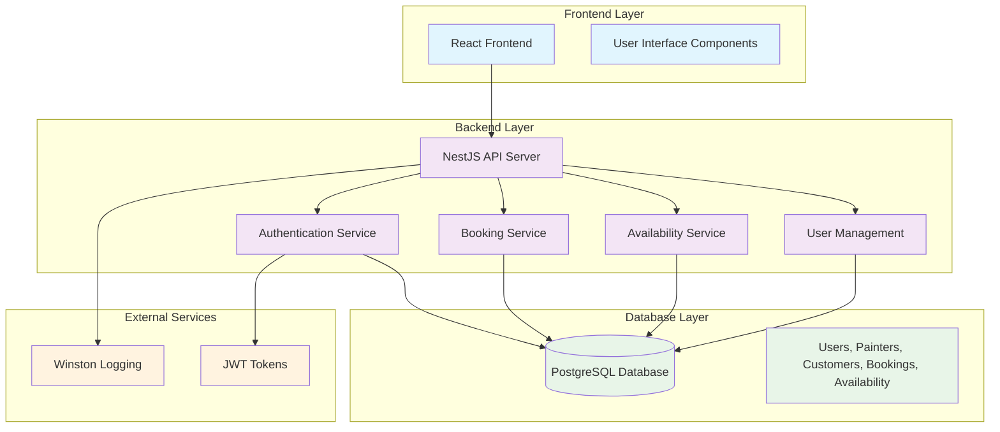

---

##  Database Entity Relationship Diagram

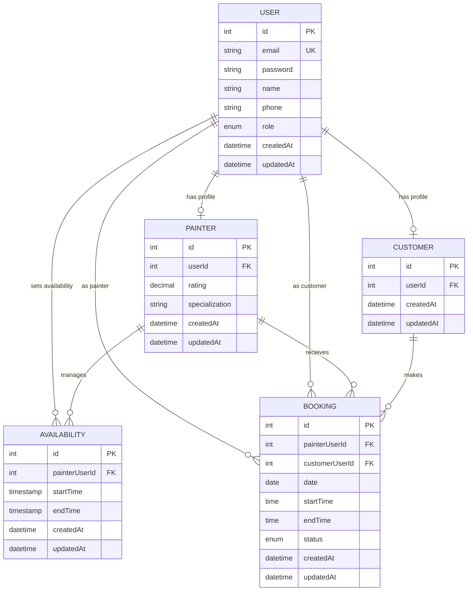

---

## User Authentication Flow

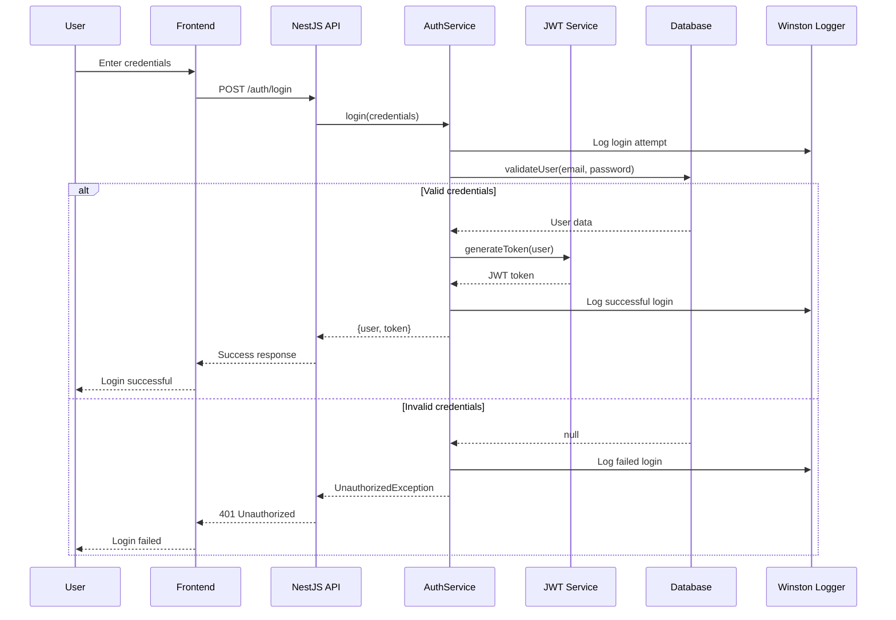

---

## Booking Process Flow

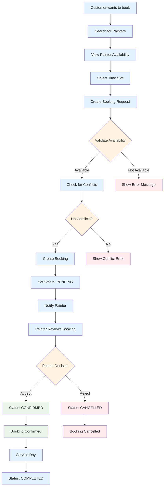

---

## API Endpoints Structure

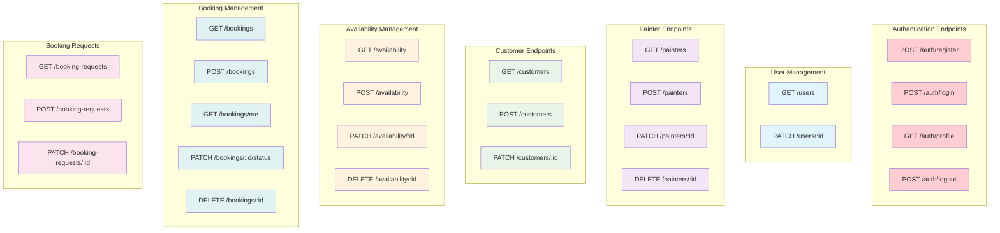

---

##  Logging System Architecture

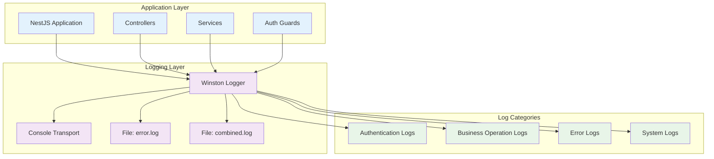

---

## Application Module Structure

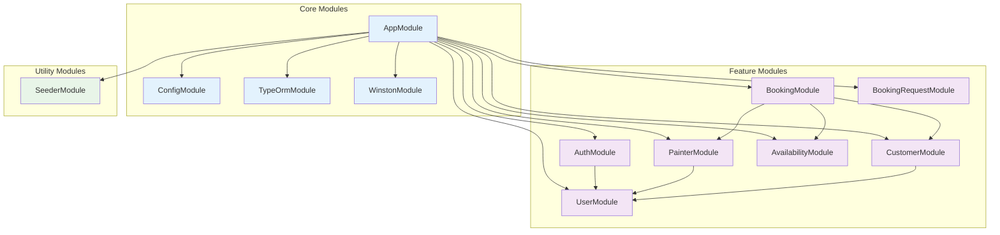

---

##  User Journey Flow

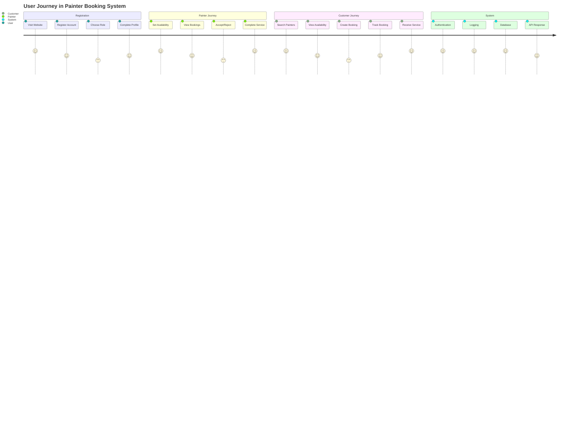

---

##  Data Flow Diagram

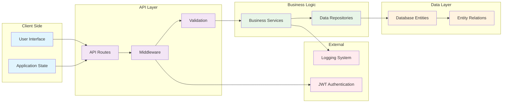

---

## 🔒 Security & Authorization Flow

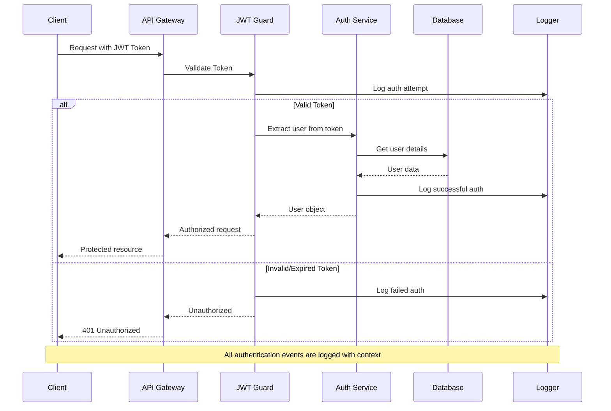

---

## 📈 System Performance Monitoring

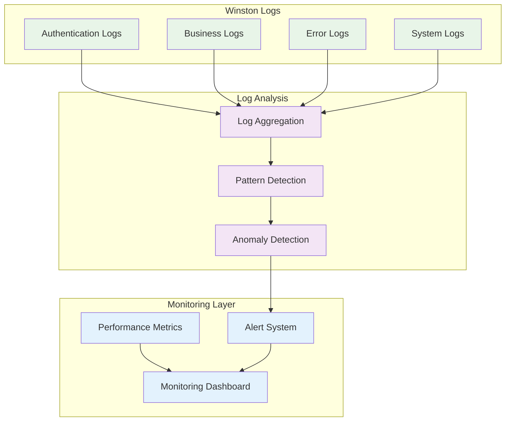

---

## Key Features Highlighted

###  **Authentication & Authorization**
- JWT-based authentication
- Role-based access control (Painter/Customer)
- Secure password hashing with bcrypt

### **Booking Management**
- Real-time availability checking
- Conflict detection and prevention
- Status tracking (Pending → Confirmed → Completed)

###  **Structured Logging**
- Winston logger with multiple transports
- Contextual logging with user information
- Error tracking and monitoring

###  **Database Design**
- Normalized entity relationships
- Proper foreign key constraints
- Optimized queries with TypeORM

###  **API Architecture**
- RESTful API design
- Input validation with class-validator
- Comprehensive error handling

---

##  Usage Instructions

1. **Copy the Mermaid code** from any diagram above
2. **Paste into your README.md** or documentation
3. **Use Mermaid Live Editor** (https://mermaid.live) to preview
4. **Customize colors and styling** as needed
5. **Export as SVG/PNG** for presentations

These diagrams provide a comprehensive visual representation of your Painter Booking System architecture, data flow, and key processes! 
